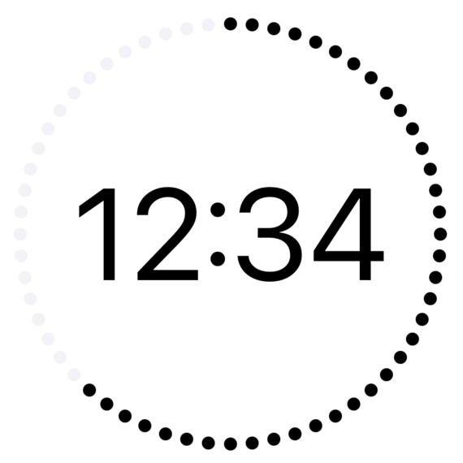
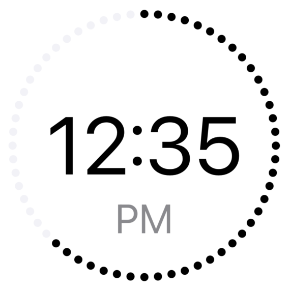
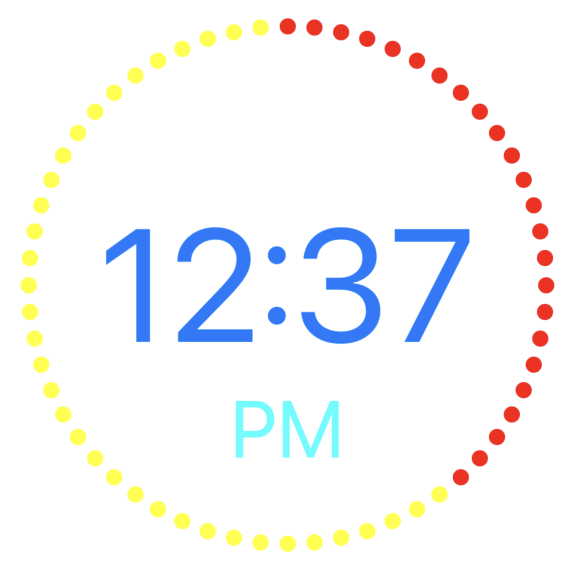
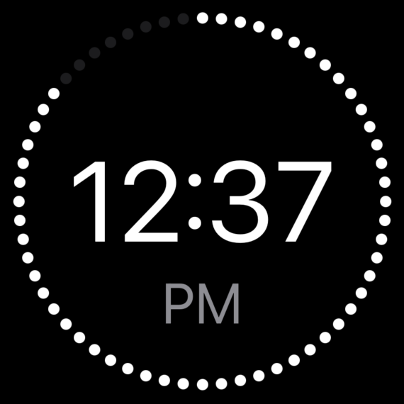

# StylishClock

The pictures are speaking for themselves I think ;)






## Usage

Initialize ClockView:
```swift
let clock = ClockView(timeFormat: TimeFormat)

let clock = ClockView(timeFormat: TimeFormat,
                      timeLabelTextColor: UIColor?, 
                      amPmLabelTextColor: UIColor?, 
                      dotsOffColor: UIColor?, 
                      dotsOnColor: UIColor?)
```

Start the clock:
```swift
clock.start()
```

Stop the clock:
```swift
clock.stop()
```

Change parameters:
```swift
clock.timeLabelTextColor = UIColor
clock.amPmLabelTextColor = UIColor // Only visible in twelveHours TimeFormat
clock.dotsOffColor = UIColor
clock.dotsOnColor = UIColor
clock.timeFormat = TimeFormat
```

## TimeFormat enum

Definition:
```swift
enum TimeFormat {
    case twentyfourHours
    case twelveHours
}
```

## Installation Using Xcode dependency manager

In Xcode: File -> Add Packages

Than paste the github link into the textfield on the top and install the package.

```
https://github.com/fabi-an-ro/StylishClock
```
